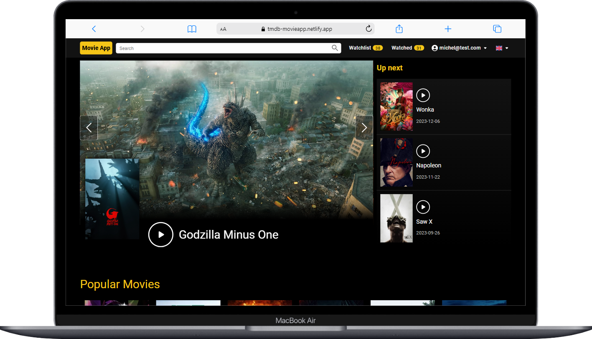

# Movie App



# This project was bootstrapped with [Vite](https://vitejs.dev/guide/).

## 💻 Project

I re-created IMDb website preserving core features and adding new ones such as a disable button to movies that have been added to a list, a watched list, and versatile list filtering by movie, TV show and all entries.

## 🚀 Stack & Tools Used:
- React.js
- Redux
- React Query
- Material UI
- Firebase
- TMDb API

## Future implementations:
-  Add user's own comments and rating to watched movies

## How to use?
#### Download/Clone this repository

#### Create a .env file and add the following keys to it:
```bash
VITE_FIREBASE_API_KEY = your_own_key
VITE_TMDB_API_KEY = your_own_key
VITE_FIREBASE_AUTH_DOMAIN = your_own_key
VITE_FIREBASE_PROJECT_ID = your_own_key
VITE_FIREBASE_STORAGE_BUCKET = your_own_key
VITE_FIREBASE_MESSAGING_SENDER_ID = your_own_key
VITE_FIREBASE_APP_ID = your_own_key
```

(replace the values from the keys above with your own)

### In the project directory, run the following commands:
##### To install dependencies and node_modules:
```bash
npm install
```

##### To start the application:
```bash
npm run dev
```

##### To see a live demo of this project, click [here](https://tmdb-movieapp.netlify.app/)

### Author
- Michel Pomerantzeff